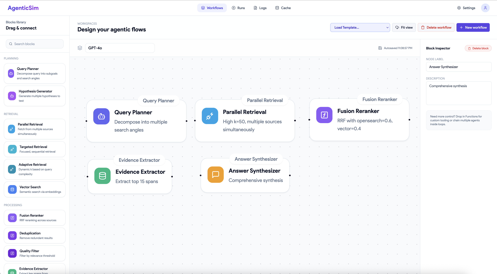

# AgentSim: A Platform for Verifiable Agent-Trace Simulation

[](https://agentsim.searchsim.org)

[](https://arxiv.org)
[](https://agentsim.searchsim.org)
[](LICENSE)

This repository contains the source code for **AgentSim**, a platform for comparative analysis of agentic retrieval workflows.

---

## Abstract

 Training trustworthy agentic LLMs requires data that shows the grounded reasoning process, not just the final answer. Existing datasets fall short: question-answering data is outcome-only, chain-of-thought data is not tied to specific documents, and web-agent datasets track interface actions rather than the core retrieval and synthesis steps of a RAG workflow. We introduce AgentSim, an open-source platform for simulating RAG agents. It generates verifiable, stepwise traces of agent reasoning over any document collection. AgentSim uses a policy to ensure the agent widely explores the document set. It combines a multi-model validation pipeline with an active human-in-the-loop process. This approach focuses human effort on difficult steps where models disagree. Using AgentSim, we built the Agent-Trace Corpus (ATC), a large collection of grounded RAG trajectories over the MSMARCO, Quasar-T, and CausalQA-22 corpora. We use ATC to compare how different LLMs manage exploration, repeated information, and uncertainty. AgentSim is a new tool for analyzing and training verifiable RAG agents. 

**Keywords**: Agentic AI, Simulation Platform, Retrieval-Augmented Generation (RAG), Data Generation

---

## What is AgentSim?

AgentSim is a controlled environment for running multi-agent simulations over document collections. It:

- **Compares Models**: Run identical tasks across GPT-4o, Mistral-Large, DeepSeek-V3, and others
- **Captures Reasoning**: Log complete thought processes, not just final answers
- **Generates Training Data**: Produce query-document-answer triples with reasoning chains
- **Enables Analysis**: Quantify exploration strategies, retrieval patterns, and synthesis behaviors

---

## Agent-Trace Corpus (ATC)

AgentSim has generated a **unified training corpus** from 3,000 exploratory simulations:

**Location**: `data/corpus/`  
**Format**: Compressed JSONL, ready for LLM training  
**Documentation**: See `data/corpus/README.md`

---

## Quick Start

### Installation

```bash
cd agentsim
poetry install
```

### Configuration

```bash
cp .env.example .env
# Add your API keys: OPENAI_API_KEY, ANTHROPIC_API_KEY, etc.
```

### Verify Setup

```bash
poetry run agentsim info
```

### Run Your First Simulation

```bash
# Standard mode: Fixed workflow, single query
poetry run agentsim simulate standard_gpt4o

# Exploratory mode: Multi-hop knowledge expansion
poetry run agentsim simulate exploratory_seeds
```

### Inspect Results

```bash
ls data/simulation_output/standard_gpt4o/
```

Each run produces:
- `traces.jsonl` – Step-by-step reasoning with LLM I/O
- `trajectories.jsonl` – High-level action sequences
- `supervised.jsonl` – Query-document-answer training pairs
- `config.json` – Run configuration
- `stats.json` – Execution statistics

---

## Project Structure

```
agentsim/
├── agentsim/                    # Core platform code
│   ├── components/             # Retrieval, planning, synthesis components
│   ├── workflow/               # Workflow execution engine
│   ├── simulation/             # Simulation modes (standard, adaptive, exploratory)
│   ├── clients/                # LLM and retrieval clients
│   └── cli.py                  # Command-line interface
│
├── templates/
│   ├── workflows/              # Reusable workflow definitions
│   └── simulations/            # End-to-end experiment configs
│
├── data/
│   ├── seeds/                  # Seed queries for simulations
│   ├── datasets/               # Raw datasets (gitignored)
│   ├── simulation_output/      # Run outputs (gitignored)
│   └── corpus/         # Training-ready corpus 
│       ├── traces/             # Reasoning traces 
│       ├── supervised/         # Training pairs
│       ├── trajectories/       # High-level actions 
│       ├── retrievals/         # Document logs
│       └── queries/            # All queries 
│
└── README.md                   # This file
```

---

## Simulation Modes

### 1. Standard Mode
Fixed workflow execution with similarity-based stopping.

**Use Case**: Reproducible benchmarking  
**Example**: `poetry run agentsim simulate standard_gpt4o`

### 2. Adaptive Mode
Teacher model selects components dynamically (HATEOAS).

**Use Case**: Studying decision-making strategies  
**Example**: `poetry run agentsim simulate adaptive_gpt4o`

### 3. Exploratory Mode
Multi-hop knowledge expansion with Active Validation.

**Use Case**: Generating diverse training data  
**Example**: `poetry run agentsim simulate exploratory_seeds`

**Active Validation**: Teacher and consultant models run in parallel. When they disagree, the system flags high-uncertainty steps for analysis.

---

## Core Components

### Retrieval
- **OpenSearch**: Full-text search over local indices
- **ChatNoir**: Web-scale retrieval (MS MARCO, ClueWeb)
- **Vector Search**: Dense retrieval with embeddings

### Planning
- **Query Decomposer**: Break complex queries into sub-questions
- **Planner**: Generate multi-step reasoning plans
- **Reflector**: Analyze knowledge gaps and suggest next queries

### Synthesis
- **Answer Drafter**: Generate candidate answers from evidence
- **Finalizer**: Produce final answer with citations
- **Verifier**: Check claims against retrieved evidence

### Processing
- **Filter**: Remove low-quality or irrelevant documents
- **Deduplicator**: Remove duplicate content
- **Reranker**: Reorder documents by relevance

---

## Analysis Tools

### Quantitative Evaluation

```bash
cd data/simulation_output/exploratory_seeds
python evaluate_runs.py --runs 6601a11b b1b576a8 fb969481
```

Computes:
- Exploration breadth (unique documents)
- Retrieval redundancy (repeated retrievals)
- Query statistics (count, length, diversity)

### Qualitative Analysis

```bash
python analyze_reformulation.py --runs 6601a11b b1b576a8 fb969481
```

Classifies query reformulations:
- **Conceptual**: Semantic expansion (e.g., "bridge collapse" → "structural failure aerodynamics")
- **Procedural**: Step-by-step planning (e.g., "I will first retrieve...")
- **Syntactic**: Keyword simplification (e.g., "why did X happen?" → "X cause")

### Figure Generation

```bash
python generate_multi_dataset_figure.py --output-dir figures/ --format pdf
```

Creates publication-ready visualizations comparing models across datasets.

---

## Training Data Use Cases

### 1. Chain-of-Thought Training
Use `corpus/traces/all_traces.jsonl.gz`:
- Step-by-step reasoning with thought → action → observation
- LLM input/output for each step
- Multi-model outputs for comparison

### 2. Imitation Learning
Use `corpus/supervised/all_supervised.jsonl.gz`:
- Query-document-answer triples
- Reasoning chains showing derivation
- Multi-hop reasoning examples

### 3. Retrieval-Augmented Generation
Use `corpus/trajectories/all_trajectories.jsonl.gz`:
- High-level decision sequences
- Document retrieval patterns
- Query reformulation strategies

### 4. Query Reformulation
Use `corpus/queries/all_queries.json.gz`:
- Original queries and reformulations
- Semantic vs syntactic patterns
- Model-specific strategies

---

## Creating Custom Simulations

### 1. Define a Workflow

Create `templates/workflows/my_workflow.yaml`:

```yaml
name: my_workflow
components:
  - type: retriever
    config:
      top_k: 20
  
  - type: filter
    config:
      min_score: 0.5

  - type: answer_drafter
    config:
      max_tokens: 500

  - type: finalizer
```

### 2. Create a Simulation Template

Create `templates/simulations/my_experiment.yaml`:

```yaml
name: my_experiment
mode: standard
workflow: my_workflow

teacher_model:
  name: gpt4o
    model_id: gpt-4o
    temperature: 0.7

dataset:
  name: msmarco
  split: train
  sample_size: 100

retrieval:
  backend: opensearch
  index: msmarco-v2.1-segmented

output_dir: data/simulation_output/my_experiment
```

### 3. Run It

```bash
poetry run agentsim simulate my_experiment
```

---

## CLI Reference

```bash
# Show platform info
agentsim info

# List available templates
agentsim list

# Run simulation
agentsim simulate <template_name>

# Generate seed queries
agentsim seed-select \
  --dataset msmarco \
  --split train \
  --num-seeds 1000 \
  --retrieval opensearch \
  --output seeds_msmarco_1k.jsonl

# Validate configuration
agentsim validate <template_name>
```

---

## Related Resources

- **Corpus Documentation**: `data/corpus/README.md`
- **Evaluation Results**: `data/simulation_output/exploratory_seeds/PAPER_RESULTS.md`
- **Methodology**: `data/simulation_output/exploratory_seeds/EVALUATION_README.md`
- **Figures**: `data/simulation_output/exploratory_seeds/figures/`


